# Clinic Management System - Use Case Diagram (Mermaid)

```mermaid
graph TB
    %% Actors positioned: 2 left, 2 right
    Student[👤 Student]
    Faculty[👤 Faculty]
    Staff[👤 Staff]
    Admin[👤 Admin]
    
    %% System boundary with use cases
    subgraph "Clinic Management System"
        %% Core Authentication
        UC_AUTH[User Authentication]
        UC_LOGIN[Login to System]
        UC_LOGOUT[Logout from System]
        UC_PASSWORD_RESET[Reset Password]
        UC_VERIFY_DOB[Verify Date of Birth]
        
        %% Patient/Student use cases
        UC_BOOK_APPOINTMENTS[Book Appointments]
        UC_CANCEL_APPOINTMENTS[Cancel Appointments]
        UC_VIEW_MEDICAL_HISTORY[View Medical History]
        UC_VIEW_PRESCRIPTIONS[View Prescriptions]
        UC_VIEW_PROFILE[View Profile]
        UC_RECEIVE_NOTIFICATIONS[Receive Notifications]
        UC_SEND_MESSAGES[Send Messages]
        
        %% Medical staff use cases
        UC_VIEW_APPOINTMENTS[View Appointments]
        UC_ISSUE_PRESCRIPTIONS[Issue Prescriptions]
        UC_ACCESS_PATIENT_PROFILES[Access Patient Profiles]
        UC_RECORD_VITALS[Record Vital Signs]
        UC_MANAGE_REFERRALS[Manage Referrals]
        UC_UPDATE_PATIENT_INFO[Update Patient Info]
        UC_SEND_PARENT_ALERTS[Send Parent Alerts]
        UC_MANAGE_INVENTORY[Manage Inventory]
        
        %% Administrative use cases
        UC_MANAGE_USERS[Manage Users]
        UC_MANAGE_PATIENTS[Manage Patient Records]
        UC_IMPORT_STUDENTS[Import Student Data]
        UC_REPORTS[Generate/View/Export Reports]
        UC_SYSTEM_CONFIG[System Configuration]
        UC_VIEW_LOGS[View System Logs]
        UC_MANAGE_STAFF[Manage Staff Profiles]
        UC_DATA_BACKUP[Data Backup]
        UC_EMAIL_NOTIFICATIONS[Send Email Notifications]
    end
    
    %% Student interactions
    Student --> UC_LOGIN
    Student --> UC_LOGOUT
    Student --> UC_BOOK_APPOINTMENTS
    Student --> UC_CANCEL_APPOINTMENTS
    Student --> UC_VIEW_MEDICAL_HISTORY
    Student --> UC_VIEW_PRESCRIPTIONS
    Student --> UC_VIEW_PROFILE
    Student --> UC_RECEIVE_NOTIFICATIONS
    Student --> UC_SEND_MESSAGES
    
    %% Faculty interactions
    Faculty --> UC_LOGIN
    Faculty --> UC_LOGOUT
    Faculty --> UC_ACCESS_PATIENT_PROFILES
    Faculty --> UC_VIEW_MEDICAL_HISTORY
    Faculty --> UC_BOOK_APPOINTMENTS
    Faculty --> UC_RECEIVE_NOTIFICATIONS
    Faculty --> UC_SEND_MESSAGES
    Faculty --> UC_VIEW_PROFILE
    
    %% Staff interactions
    Staff --> UC_LOGIN
    Staff --> UC_LOGOUT
    Staff --> UC_VIEW_APPOINTMENTS
    Staff --> UC_MANAGE_PATIENTS
    Staff --> UC_ISSUE_PRESCRIPTIONS
    Staff --> UC_MANAGE_INVENTORY
    Staff --> UC_RECORD_VITALS
    Staff --> UC_MANAGE_REFERRALS
    Staff --> UC_SEND_PARENT_ALERTS
    Staff --> UC_UPDATE_PATIENT_INFO
    Staff --> UC_SEND_MESSAGES
    
    %% Admin interactions
    Admin --> UC_LOGIN
    Admin --> UC_LOGOUT
    Admin --> UC_MANAGE_USERS
    Admin --> UC_MANAGE_PATIENTS
    Admin --> UC_IMPORT_STUDENTS
    Admin --> UC_REPORTS
    Admin --> UC_SYSTEM_CONFIG
    Admin --> UC_VIEW_LOGS
    Admin --> UC_MANAGE_STAFF
    Admin --> UC_DATA_BACKUP
    
    %% Authentication include relationships
    UC_LOGIN -.-> UC_AUTH
    UC_LOGOUT -.-> UC_AUTH
    UC_BOOK_APPOINTMENTS -.-> UC_AUTH
    UC_VIEW_APPOINTMENTS -.-> UC_AUTH
    UC_MANAGE_USERS -.-> UC_AUTH
    
    %% Optional/conditional behaviors (extends)
    UC_VERIFY_DOB -.-> UC_LOGIN
    UC_PASSWORD_RESET -.-> UC_LOGIN
    
    %% Notification relationships
    UC_SEND_PARENT_ALERTS -.-> UC_EMAIL_NOTIFICATIONS
    UC_RECEIVE_NOTIFICATIONS -.-> UC_EMAIL_NOTIFICATIONS
    
    %% Positioning hints
    classDef actor fill:#e1f5fe,stroke:#01579b,stroke-width:2px
    classDef usecase fill:#f3e5f5,stroke:#4a148c,stroke-width:2px
    classDef system fill:#fff3e0,stroke:#e65100,stroke-width:3px
    
    class Student,Faculty,Staff,Admin actor
    class UC_AUTH,UC_LOGIN,UC_LOGOUT,UC_PASSWORD_RESET,UC_VERIFY_DOB,UC_BOOK_APPOINTMENTS,UC_CANCEL_APPOINTMENTS,UC_VIEW_MEDICAL_HISTORY,UC_VIEW_PRESCRIPTIONS,UC_VIEW_PROFILE,UC_RECEIVE_NOTIFICATIONS,UC_SEND_MESSAGES,UC_VIEW_APPOINTMENTS,UC_ISSUE_PRESCRIPTIONS,UC_ACCESS_PATIENT_PROFILES,UC_RECORD_VITALS,UC_MANAGE_REFERRALS,UC_UPDATE_PATIENT_INFO,UC_SEND_PARENT_ALERTS,UC_MANAGE_INVENTORY,UC_MANAGE_USERS,UC_MANAGE_PATIENTS,UC_IMPORT_STUDENTS,UC_REPORTS,UC_SYSTEM_CONFIG,UC_VIEW_LOGS,UC_MANAGE_STAFF,UC_DATA_BACKUP,UC_EMAIL_NOTIFICATIONS usecase
```

## **Key Features:**

### **Actors (4 total):**
- **Student** - Patient/student users
- **Faculty** - Faculty members
- **Staff** - Medical personnel
- **Admin** - System administrators

### **Use Cases (28 total):**
- **Authentication:** Login, Logout, Password Reset, User Authentication
- **Patient/Student:** Book/Cancel Appointments, View Medical History, View Prescriptions
- **Medical Staff:** View Appointments, Issue Prescriptions, Record Vitals, Manage Referrals
- **Administrative:** Manage Users, Generate Reports, System Configuration, Data Backup

### **Relationships:**
- **Solid arrows (-->)**: Direct actor-to-use case interactions
- **Dashed arrows (-.->)**: Include/Extend relationships
- **Include**: Authentication required for most operations
- **Extend**: Optional behaviors like password reset, date verification

### **Layout:**
- Actors positioned outside system boundary
- Use cases contained within "Clinic Management System" boundary
- Clear visual separation between different user types
- Professional color coding for different element types
